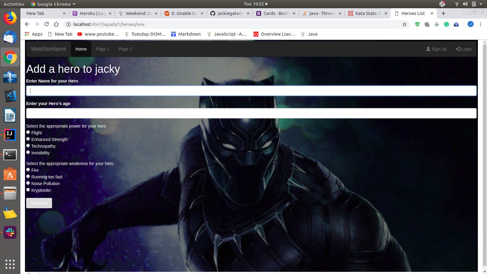
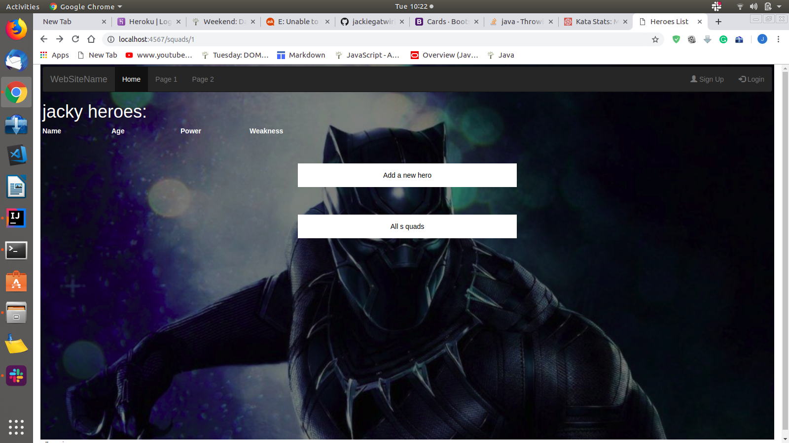
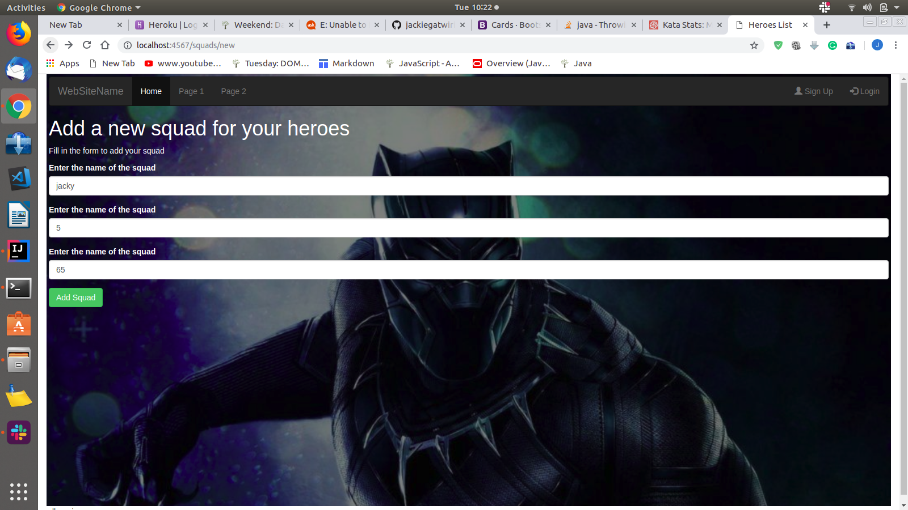

# Hero Squad
## Description
```
This is a spark application where one can add his favorite hero in the squad category. A user needs to provide a squad which will contain all his heroes and provide the name, age, power and weakness.




```
## Contributors
```
The contributors of this project were:
* Jackline Gatwiri (jaciegatz@gmail.com)
```
## Technologies used
```
* Java.
* Spark - the front end framework.
```
## B-D-D
```
| Input                                | Behaviour                                        | Output                                      |
|--------------------------------------|--------------------------------------------------|---------------------------------------------|
| The user requests for page           | The application searches for the index file      | The user is presented with the landing page |
| The user clicks "Add hero"           | The application looks for the input form.        | The user is given a form to fill            |
| The user clicks "Submit"             | The application retrieves the user's data        | The user's data is stored.                  |
| The user requests for the squad data | The application looks for the squad information. | The user is given the squad data.           |
```
## Know bugs
```
Some of the known bugs include:
* The background image not loading
* 500 internal error( Unable to find some vtl files)
```
## Licencing
```
[MIT License](https://choosealicense.com/licenses/mit/)

```
